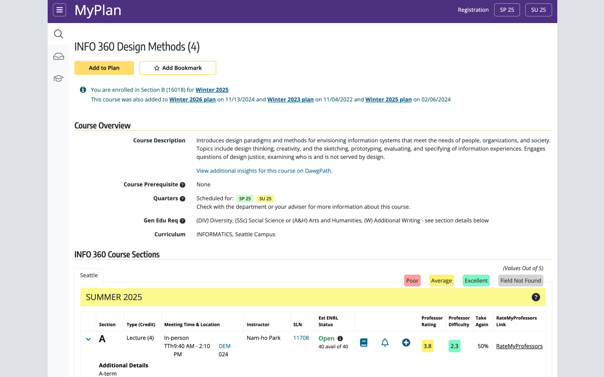

# RateMyProf Assistant for UW MyPlan Extension

### Make Smarter Course Decisions with Just One Click! 🖱️

Choosing the right professor can make or break your class experience. With the **MyPlan Professor Rating Extension**, you no longer need to hop between tabs and search for ratings manually. This Chrome extension seamlessly integrates **RateMyProfessors.com** ratings directly into your University of Washington MyPlan platform, helping you make more informed choices without the hassle!

Wondering how difficult a course might be? 📚 Or curious about how many students would actually take a class again with a professor? 🤔 Now, it's all right in front of you as you plan your schedule.

This tool is **non-profit** and built with students in mind, making the registration process easier and more transparent. All the information presented comes from **RateMyProfessors** and remains **unmanipulated**.

### Features ✨

- **Professor Rating**: See the overall rating of your professors from RateMyProfessors ⭐.
- **Difficulty**: View how challenging a professor's course is rated by students 💪.
- **Would Take Again**: Find out the percentage of students who would retake a class with the professor 🔁.
- **Direct Link to Profiles**: Click on a convenient link to visit the professor’s full profile on RateMyProfessors 🌐.
- **Only Active for Signed-in Users**: The extension ensures that only logged-in MyPlan users can see the additional features 🔒.

### Installation ⚙️

#### One-Click Download [Here](https://chromewebstore.google.com/detail/ratemyprof-assistant-for/ofkeokbllkoiceaekhaljfjbjegahaej?authuser=0&hl=en)!

### Privacy & Data Collection 🔐

This extension **does not collect or store any personal data**. It only scrapes publicly available information from RateMyProfessors and injects it into the MyPlan page to assist students with course selection. No user data is transmitted to any external server.

### Contributions 🤝

Contributions, bug reports, and feature requests are welcome! Feel free to check the [issues page](https://github.com/your-username/myplan-professor-rating-extension/issues) if you find any bugs or have suggestions.

1. Fork this repository 🍴.
2. Create a branch: `git checkout -b feature/your-feature-name`.
3. Submit a pull request detailing the changes.

### License

[MIT License](LICENSE)

---

This extension is **independently developed** and is **not affiliated with or endorsed by**:
- **RateMyProfessors.com**
- **University of Washington**
- **MyPlan**

It is a non-profit tool designed purely for educational purposes to help students make better academic decisions 📘.

# Privacy Policy 🛡️

### MyPlan Professor Rating Extension

_Last updated: [Date]_

The **MyPlan Professor Rating Extension** ("we", "our", or "the extension") does not collect, store, or share any personal data from users. The extension solely interacts with publicly available information from ratemyprofessors.com and injects it into the University of Washington's MyPlan platform to assist students in making course decisions. Below is more detail on how we handle your data:

### 1. **Data Collection** 
- **No Personal Data**: This extension does not collect, store, or transmit any personally identifiable information, health information, financial data, authentication credentials, or communication records.
- **No User Activity Tracking**: The extension does not track user activity, web history, or monitor any interaction on websites apart from its intended function within the MyPlan platform.

### 2. **Permissions** 
The extension requires the following permissions:
- **scripting**: To display professor ratings directly on the active MyPlan page and fetch ratings in the background.

These permissions are solely used to enhance the user experience by displaying professor ratings while using MyPlan. No other sites or personal data are accessed.

### 3. **Data Sharing** 
This extension does not share any user data with third parties. It only fetches publicly available data from ratemyprofessors.com for display within MyPlan.

### 4. **External Links** 
The extension may include links to ratemyprofessors.com to allow users to view full professor profiles. These external sites are governed by their own privacy policies, and we encourage users to review them.

### 5. **Changes to This Privacy Policy** 
We reserve the right to update this privacy policy at any time. Any changes will be reflected on this GitHub repository.

### 6. **Contact** 
If you have any questions regarding this privacy policy, please contact us via the repository's issue page.
